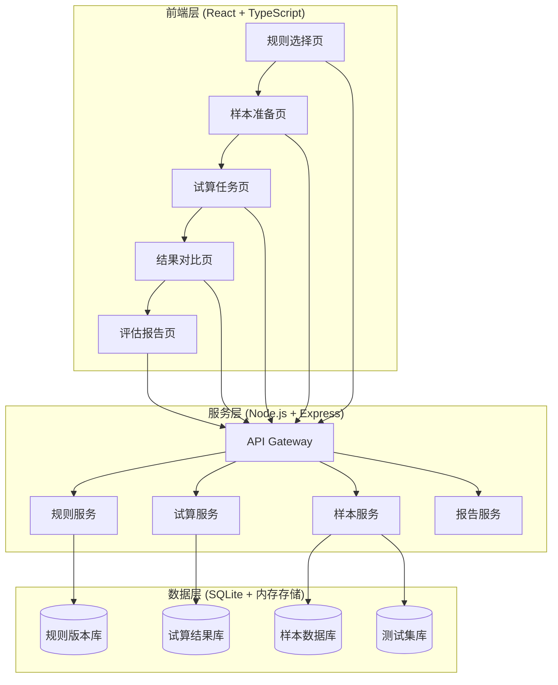
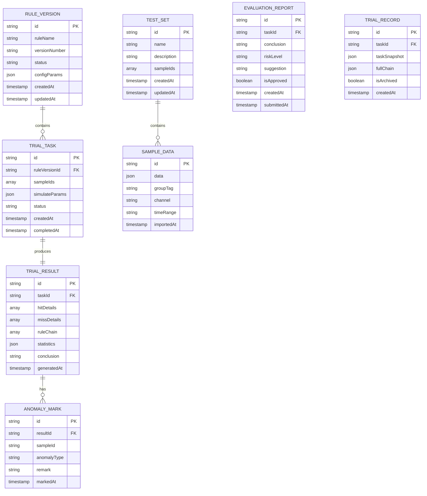

# 规则引擎试算评估台 - 技术架构文档

## 1. 架构设计

### 1.1 系统架构层次



### 1.2 技术选型

| 层级 | 技术选型 | 说明 |
|------|---------|------|
| 前端框架 | React 18 + TypeScript | 组件化开发，类型安全 |
| 构建工具 | Vite | 快速开发和构建 |
| UI框架 | Tailwind CSS | 原子化CSS，快速样式开发 |
| 路由管理 | React Router v6 | SPA路由管理 |
| 状态管理 | Zustand | 轻量级状态管理 |
| HTTP客户端 | Axios | API请求处理 |
| 数据可视化 | Recharts | 图表展示 |
| 日期处理 | Day.js | 轻量级日期库 |
| 表格组件 | TanStack Table | 灵活的数据表格 |
| 文件处理 | SheetJS | Excel/CSV解析和导出 |
| 后端框架 | Express.js | 轻量级Node.js框架 |
| 数据库 | SQLite | 嵌入式数据库，适合演示环境 |
| ORM | better-sqlite3 | 高性能SQLite ORM |

## 2. 项目结构

```
rule-engine-trial/
├── src/
│   ├── components/          # 通用组件
│   │   ├── common/          # 通用UI组件
│   │   ├── layout/          # 布局组件
│   │   └── charts/           # 图表组件
│   ├── pages/               # 页面组件
│   │   ├── RuleSelection/   # 规则选择页
│   │   ├── SamplePrep/       # 样本准备页
│   │   ├── TrialTask/        # 试算任务页
│   │   ├── ResultCompare/    # 结果对比页
│   │   └── EvaluationReport/ # 评估报告页
│   ├── services/            # API服务
│   ├── stores/              # 状态管理
│   ├── types/               # TypeScript类型定义
│   ├── utils/               # 工具函数
│   ├── data/                # Mock数据
│   └── styles/              # 全局样式
├── server/                  # 后端服务
│   ├── routes/              # API路由
│   ├── controllers/         # 控制器
│   ├── services/             # 业务逻辑
│   ├── models/              # 数据模型
│   └── database/             # 数据库配置
├── public/                  # 静态资源
└── package.json
```

## 3. 路由定义

### 3.1 前端路由

| 路由路径 | 页面名称 | 功能描述 |
|---------|---------|---------|
| / | 首页/规则选择 | 规则版本列表和管理 |
| /samples | 样本准备 | 样本数据导入和管理 |
| /tasks | 试算任务 | 创建和管理试算任务 |
| /results/:taskId | 结果对比 | 查看和对比试算结果 |
| /reports | 评估报告 | 生成评估结论和报告 |
| /history | 历史记录 | 查看完整试算历史 |

### 3.2 后端API路由

| API端点 | 方法 | 功能描述 |
|--------|------|---------|
| /api/rules | GET | 获取规则列表 |
| /api/rules/:id | GET | 获取规则详情 |
| /api/rules/:id/versions | GET | 获取规则版本列表 |
| /api/samples | GET | 获取样本列表 |
| /api/samples | POST | 导入样本数据 |
| /api/samples/validate | POST | 验证样本数据 |
| /api/testsets | GET | 获取测试集列表 |
| /api/testsets | POST | 创建测试集 |
| /api/testsets/:id | PUT | 更新测试集 |
| /api/tasks | GET | 获取任务列表 |
| /api/tasks | POST | 创建试算任务 |
| /api/tasks/:id | GET | 获取任务详情 |
| /api/tasks/:id/execute | POST | 执行任务 |
| /api/results/:taskId | GET | 获取任务结果 |
| /api/results/:taskId/compare | GET | 对比版本结果 |
| /api/reports | GET | 获取评估报告列表 |
| /api/reports | POST | 生成评估报告 |
| /api/records | GET | 获取历史记录 |
| /api/export/:taskId | GET | 导出任务结果 |

## 4. 数据模型

### 4.1 数据实体关系图



### 4.2 数据定义语言 (DDL)

```sql
-- 规则版本表
CREATE TABLE rule_versions (
    id TEXT PRIMARY KEY,
    rule_name TEXT NOT NULL,
    version_number TEXT NOT NULL,
    status TEXT CHECK(status IN ('draft', 'published', 'archived')),
    config_params JSON,
    created_at DATETIME DEFAULT CURRENT_TIMESTAMP,
    updated_at DATETIME DEFAULT CURRENT_TIMESTAMP,
    UNIQUE(rule_name, version_number)
);

-- 测试集表
CREATE TABLE test_sets (
    id TEXT PRIMARY KEY,
    name TEXT NOT NULL,
    description TEXT,
    created_at DATETIME DEFAULT CURRENT_TIMESTAMP,
    updated_at DATETIME DEFAULT CURRENT_TIMESTAMP
);

-- 样本数据表
CREATE TABLE sample_data (
    id TEXT PRIMARY KEY,
    test_set_id TEXT,
    data JSON NOT NULL,
    group_tag TEXT,
    channel TEXT,
    time_range TEXT,
    imported_at DATETIME DEFAULT CURRENT_TIMESTAMP,
    FOREIGN KEY (test_set_id) REFERENCES test_sets(id)
);

-- 试算任务表
CREATE TABLE trial_tasks (
    id TEXT PRIMARY KEY,
    rule_version_id TEXT NOT NULL,
    simulate_params JSON,
    status TEXT CHECK(status IN ('pending', 'running', 'completed', 'failed')),
    created_at DATETIME DEFAULT CURRENT_TIMESTAMP,
    completed_at DATETIME,
    FOREIGN KEY (rule_version_id) REFERENCES rule_versions(id)
);

-- 任务样本关联表
CREATE TABLE task_samples (
    task_id TEXT NOT NULL,
    sample_id TEXT NOT NULL,
    PRIMARY KEY (task_id, sample_id),
    FOREIGN KEY (task_id) REFERENCES trial_tasks(id),
    FOREIGN KEY (sample_id) REFERENCES sample_data(id)
);

-- 试算结果表
CREATE TABLE trial_results (
    id TEXT PRIMARY KEY,
    task_id TEXT UNIQUE NOT NULL,
    hit_details JSON,
    miss_details JSON,
    rule_chain JSON,
    statistics JSON,
    conclusion TEXT,
    generated_at DATETIME DEFAULT CURRENT_TIMESTAMP,
    FOREIGN KEY (task_id) REFERENCES trial_tasks(id)
);

-- 异常标记表
CREATE TABLE anomaly_marks (
    id TEXT PRIMARY KEY,
    result_id TEXT NOT NULL,
    sample_id TEXT NOT NULL,
    anomaly_type TEXT,
    remark TEXT,
    marked_at DATETIME DEFAULT CURRENT_TIMESTAMP,
    FOREIGN KEY (result_id) REFERENCES trial_results(id)
);

-- 评估报告表
CREATE TABLE evaluation_reports (
    id TEXT PRIMARY KEY,
    task_id TEXT NOT NULL,
    conclusion TEXT,
    risk_level TEXT CHECK(risk_level IN ('low', 'medium', 'high', 'critical')),
    suggestion TEXT,
    is_approved BOOLEAN DEFAULT FALSE,
    created_at DATETIME DEFAULT CURRENT_TIMESTAMP,
    submitted_at DATETIME,
    FOREIGN KEY (task_id) REFERENCES trial_tasks(id)
);

-- 试算记录表
CREATE TABLE trial_records (
    id TEXT PRIMARY KEY,
    task_id TEXT NOT NULL,
    task_snapshot JSON NOT NULL,
    full_chain JSON,
    is_archived BOOLEAN DEFAULT FALSE,
    created_at DATETIME DEFAULT CURRENT_TIMESTAMP,
    FOREIGN KEY (task_id) REFERENCES trial_tasks(id)
);

-- 索引优化
CREATE INDEX idx_rule_status ON rule_versions(status);
CREATE INDEX idx_task_status ON trial_tasks(status);
CREATE INDEX idx_task_created ON trial_tasks(created_at);
CREATE INDEX idx_sample_group ON sample_data(group_tag);
CREATE INDEX idx_result_task ON trial_results(task_id);
CREATE INDEX idx_record_task ON trial_records(task_id);
CREATE INDEX idx_record_archived ON trial_records(is_archived);
```

## 5. API接口详细定义

### 5.1 规则相关接口

#### GET /api/rules
**功能**: 获取规则列表

**响应示例**:
```json
{
  "success": true,
  "data": [
    {
      "id": "rule_001",
      "ruleName": "风控规则-交易限额",
      "versionNumber": "v2.1.0",
      "status": "published",
      "createdAt": "2026-06-01T10:00:00Z"
    }
  ],
  "pagination": {
    "page": 1,
    "pageSize": 20,
    "total": 45
  }
}
```

#### POST /api/samples
**功能**: 导入样本数据

**请求体**:
```json
{
  "testSetId": "ts_001",
  "data": [
    {
      "userId": "user_1001",
      "amount": 5000,
      "channel": "mobile",
      "group": "vip"
    }
  ],
  "groupTag": "test_group_1"
}
```

### 5.2 任务相关接口

#### POST /api/tasks
**功能**: 创建试算任务

**请求体**:
```json
{
  "ruleVersionId": "rule_001",
  "sampleIds": ["sample_001", "sample_002"],
  "simulateParams": {
    "startTime": "2026-06-01",
    "endTime": "2026-06-30",
    "environment": "staging"
  }
}
```

**响应示例**:
```json
{
  "success": true,
  "data": {
    "id": "task_001",
    "status": "pending",
    "createdAt": "2026-06-12T10:00:00Z"
  }
}
```

#### POST /api/tasks/:id/execute
**功能**: 执行试算任务

**响应示例**:
```json
{
  "success": true,
  "data": {
    "taskId": "task_001",
    "status": "running",
    "progress": 0
  }
}
```

### 5.3 结果相关接口

#### GET /api/results/:taskId
**功能**: 获取任务结果

**响应示例**:
```json
{
  "success": true,
  "data": {
    "taskId": "task_001",
    "statistics": {
      "total": 100,
      "hitCount": 85,
      "missCount": 15,
      "passRate": 85.0,
      "avgExecutionTime": 125
    },
    "hitDetails": [
      {
        "sampleId": "sample_001",
        "userId": "user_1001",
        "hit": true,
        "hitRule": "rule_001",
        "hitCondition": "amount > 1000 && amount <= 5000",
        "action": "allow"
      }
    ],
    "missDetails": [
      {
        "sampleId": "sample_002",
        "userId": "user_1002",
        "hit": false,
        "reason": "amount <= 1000",
        "suggestion": "低于最低交易限额"
      }
    ],
    "ruleChain": [
      {
        "nodeId": "node_001",
        "ruleName": "基础规则检查",
        "status": "passed",
        "executionTime": 15
      }
    ]
  }
}
```

#### GET /api/results/:taskId/compare
**功能**: 对比新旧版本结果

**响应示例**:
```json
{
  "success": true,
  "data": {
    "oldVersion": "v2.0.0",
    "newVersion": "v2.1.0",
    "comparison": {
      "oldPassRate": 82.5,
      "newPassRate": 85.0,
      "passRateChange": +2.5,
      "affectedSamples": [
        {
          "sampleId": "sample_003",
          "oldResult": "blocked",
          "newResult": "allowed",
          "reason": "规则条件调整"
        }
      ],
      "statistics": {
        "improved": 15,
        "degraded": 5,
        "unchanged": 80
      }
    }
  }
}
```

## 6. 核心功能实现方案

### 6.1 规则引擎模拟器

```typescript
interface RuleConfig {
  id: string;
  name: string;
  conditions: RuleCondition[];
  actions: RuleAction[];
}

interface RuleCondition {
  field: string;
  operator: '>' | '<' | '>=' | '<=' | '==' | '!=' | 'in' | 'contains';
  value: any;
  logic?: 'AND' | 'OR';
}

interface RuleAction {
  type: 'allow' | 'block' | 'review' | 'flag';
  priority: number;
}

// 规则执行引擎
class RuleEngine {
  execute(sample: SampleData, rule: RuleConfig): ExecutionResult {
    // 1. 解析条件
    // 2. 执行条件判断
    // 3. 记录执行链路
    // 4. 返回执行结果
  }
}
```

### 6.2 样本数据处理器

```typescript
interface SampleProcessor {
  // 解析Excel/CSV
  parseFile(file: File): Promise<RawSample[]>;
  
  // 数据验证
  validate(data: RawSample[], schema: ValidationSchema): ValidationResult;
  
  // 数据转换
  transform(data: RawSample[]): SampleData[];
  
  // 分组统计
  groupBy(data: SampleData[], dimension: string): GroupedData;
}
```

### 6.3 批量任务调度器

```typescript
interface TaskScheduler {
  // 创建批量任务
  createBatchTasks(config: BatchConfig): TrialTask[];
  
  // 并发执行控制
  executeBatch(tasks: TrialTask[], concurrency: number): Promise<TaskResult[]>;
  
  // 进度跟踪
  trackProgress(taskId: string): TaskProgress;
  
  // 结果汇总
  aggregateResults(taskIds: string[]): AggregateReport;
}
```

## 7. 前端组件架构

### 7.1 页面组件结构

```
App
├── Layout
│   ├── Header
│   ├── Sidebar
│   └── MainContent
│
├── RuleSelectionPage
│   ├── RuleList
│   ├── RuleDetail
│   ├── VersionCompare
│   └── RuleConfig
│
├── SamplePrepPage
│   ├── DataImport
│   ├── SampleTable
│   ├── TestSetManager
│   └── GroupManager
│
├── TrialTaskPage
│   ├── TaskWizard
│   ├── TaskQueue
│   └── TaskMonitor
│
├── ResultComparePage
│   ├── ResultSummary
│   ├── HitDetails
│   ├── MissAnalysis
│   ├── RuleChainDiagram
│   ├── VersionDiff
│   └── GroupStatistics
│
└── EvaluationReportPage
    ├── ConclusionGenerator
    ├── SuggestionForm
    ├── ReportViewer
    └── HistoryList
```

### 7.2 核心组件状态管理

```typescript
// 使用Zustand进行状态管理
interface AppState {
  // 规则状态
  rules: RuleVersion[];
  selectedRule: RuleVersion | null;
  
  // 样本状态
  samples: SampleData[];
  testSets: TestSet[];
  selectedSamples: string[];
  
  // 任务状态
  tasks: TrialTask[];
  currentTask: TrialTask | null;
  
  // 结果状态
  currentResult: TrialResult | null;
  comparisonData: ComparisonData | null;
  
  // 报告状态
  reports: EvaluationReport[];
  currentReport: EvaluationReport | null;
  
  // UI状态
  loading: boolean;
  error: string | null;
}
```

## 8. 部署架构

### 8.1 开发环境

```yaml
# docker-compose.dev.yml
version: '3.8'

services:
  frontend:
    build:
      context: .
      dockerfile: Dockerfile.dev
    ports:
      - "3000:3000"
    volumes:
      - ./src:/app/src
    environment:
      - VITE_API_BASE_URL=http://localhost:4000/api
    
  backend:
    build:
      context: ./server
      dockerfile: Dockerfile.dev
    ports:
      - "4000:4000"
    volumes:
      - ./server:/app
      - ./data:/app/data
    environment:
      - NODE_ENV=development
      - DB_PATH=/app/data/trial.db
```

### 8.2 生产环境

```yaml
# docker-compose.prod.yml
version: '3.8'

services:
  frontend:
    build:
      context: .
      dockerfile: Dockerfile
    ports:
      - "80:80"
      - "443:443"
    environment:
      - VITE_API_BASE_URL=/api
    
  backend:
    build:
      context: ./server
      dockerfile: Dockerfile
    ports:
      - "4000:4000"
    volumes:
      - ./data:/app/data
      - ./logs:/app/logs
    environment:
      - NODE_ENV=production
      - DB_PATH=/app/data/trial.db
      - LOG_LEVEL=info
```

## 9. 安全考虑

### 9.1 身份认证

- JWT Token认证
- Token刷新机制
- 登录状态管理

### 9.2 权限控制

- 基于角色的访问控制（RBAC）
- 页面级权限控制
- API级权限验证

### 9.3 数据安全

- 敏感数据加密存储
- 传输层使用HTTPS
- SQL注入防护
- XSS攻击防护
- CSRF Token验证

### 9.4 审计日志

- 记录所有关键操作
- 操作人、操作时间、操作内容
- 日志保留90天

## 10. 性能优化

### 10.1 前端优化

- 代码分割和懒加载
- 组件级别缓存
- 虚拟滚动（大量数据）
- 图片懒加载
- Tree shaking

### 10.2 后端优化

- 数据库索引优化
- 查询结果缓存
- 连接池管理
- 批量操作优化
- 异步任务队列

### 10.3 监控告警

- 请求响应时间监控
- 错误率监控
- 资源使用监控
- 任务执行状态监控

## 11. 测试策略

### 11.1 单元测试

- Jest + React Testing Library
- 组件测试覆盖率 > 80%
- 工具函数测试覆盖率 > 90%

### 11.2 集成测试

- Supertest API测试
- 数据库操作测试
- 业务流程测试

### 11.3 E2E测试

- Playwright端到端测试
- 关键用户路径覆盖
- 跨浏览器兼容性测试
